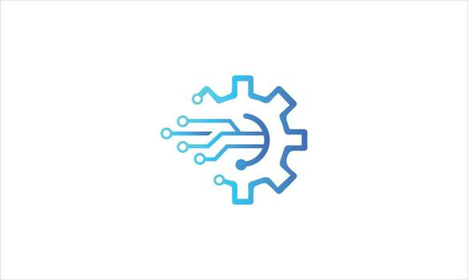

# Uruz - Thoughts
**This repository,**
\
hosts writings prepared collaboratively by myself and other contributors.
# Uruz Thoughts

**The content,**
\
covers software development topics, architectural approaches, and thoughts
or articles on various subjects.

**The goal,**
\
is to create a space where individual and collaborative works are gathered,
and where ideas can be shared in an organized and accessible manner.
Bu repo, kavramsal yazılarımı ve tasarım notlarımı içerir.  
Her yazı ayrı bir dosyada detaylı olarak sunulmuştur.  

---

## Symbols

   &nbsp;&nbsp; &nbsp;&nbsp;
   &nbsp;&nbsp;

## İçerik

---

- [Value Theory Notes](./docs/value-theory.md)  
  *Finansal sistemler ve değer teorisi üzerine düşünceler.*  

- [Software Design Reflections](./docs/software-design.md)  
  *Modüler yazılım mimarisi ve Python paket tasarımı üzerine notlar.*  

## License
**This repository is licensed under**
**[Creative Commons BY-NC 4.0](./LICENSE.md).**
- [Personal Symbolism](./docs/personal-symbolism.md)  
  *Kimlik, semboller ve kişisel marka üzerine yazılar.*  

---

## Links
- [**EN**] - [Click here for English document.](./docs/README-EN.md)
- [**TR**] - [Türkçe belge için buraya tıklayın.](./docs/README-TR.md)
## Dil Seçenekleri
- [English Version](./docs/README-EN.md)  
- [Türkçe Versiyon](./docs/README-TR.md)
