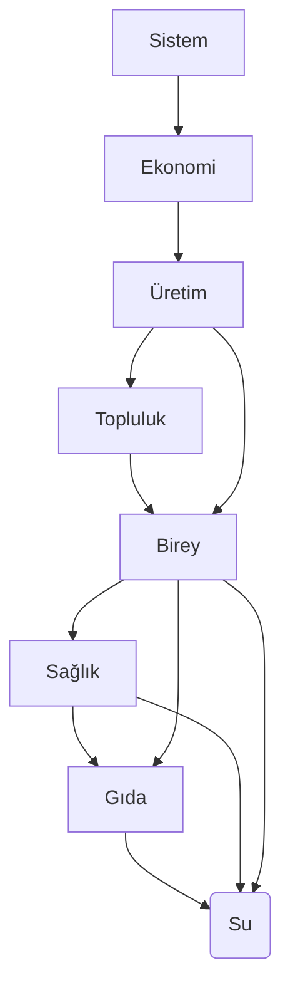

# Finansal Temel ve Değer Kavramı
\
**Belgenin Ortaya Çıkış Tarihi:**
2026-08-27
\
**Belge Sürümü:**
V1.0
\
**Belgeyi Oluşturanlar:**
Utku Ün (Uruz)
\
**Belgeyi Çevirenler:**
Bu belge, yazarın ana dilinde yazılmıştır.

---

**Bu belge,** finansal değer kavramını sistematik bir çerçevede tanımlamak
için hazırlanmıştır.
\
İlk bölümde "değer"'in anlamı açıklanmış, ardından altının tarihsel ve
evrensel ölçü birimi olarak rolü ele alınmıştır. Üçüncü bölümde
finansal değer; gelir, gider ve net değer boyutlarıyla incelenmiş,
net değerin ölçüm yöntmeleri ve kritik önemi vurgulanmıştır.

**Belge,** yalnızca teorik bir tanım sunmakla kalmaz; aynı zamanda tablolar
aracılığıyla kısa ve uzun vadeli finansal değer takibini gösterir.
**Böylece bireysel ve toplumsal düzeyde finansal disiplinin nasıl**
**sağlanabileceğine dair hem kavramsal hem pratik bir yol haritası sunar.**

---

**Başlıklar:**
- [1. Değer Nedir?](#1-değer-nedir)
  - [1.1 İhtiyaçlar Hiyerarşisi](#11-i̇htiyaçlar-hiyerarşisi)
- [2. Altının Evrensel Değeri](#2-altının-evrensel-değeri)
- [3. Finansal Değerin Tanımı](#3-finansal-değerin-tanımı)
  - [3.1 Net Değer Nasıl Ölçülür](#31-net-değer-nasıl-ölçülür)
  - [3.2 Net Değerin Kritik Önemi](#32-net-değerin-kritik-önemi)
  - [3.3 Finansal Değer Tabloları](#33-finansal-değer-tabloları)
  - [3.3.1 Tablo Standartları](#331-tablo-standartları)
  - [3.3.2 Tablolar](#332-tablolar)
  - [3.3.3 Ek Tablolar](#333-ek-tablolar)

---

## 1. Değer nedir?
Değer, nadirlikten değil **yaşamı sürdürme ve üretime katkısından** doğar.
\
**Yani kısaca, değer** hem soyut bir düşünce hem de somut bir nesne olabilir; 
önemli olan yaşamı sürdürmeye ve üretime katkı sağlamasıdır.

- **Uranyum, elmas gibi hammaddeler (değerli madenler)** nadir oldukları
  için değerli görünür.
  Ancak bu değer, sistemin işleyişine ve güvenine dayanır.
  **Sistem çökerse işlenemez hale gelir ve anlamını yitirir.**
- **Tarım** ise sistem olsun ya da olmasın her zaman temel değerdir. Çünkü
  doğrudan insanın en temel ihtiyacına çözüm sunar: *gıda*. 
  **Aç bir insan düşünemez, üretemez, yaşayamaz.** Aynı zamanda sağlığın
  temellerini oluşturan kritik anahtarlardan biridir.
  
  **Tarım toplumların sürdürülebilirliği için stratejik bir değerdir.**
  Ekonomik sistemler çöktüğünde bile gıda üretimi devam ettiği sürece yaşam
  ve üretim kapasitesi korunur. Bu nedenle tarım, hem bireysel hem de
  toplumsal açıdan en temel ve vazgeçilmez değer olarak kabul edilmelidir.

- **Su  yaşamın anahtarıdır** ve tüm canlılar için en değerli varlıktır.
  Dünya üzerindeki her şeyin temelinde su vardır; bu nedenle kritik bir
  kaynaktır. Tarih boyunca topluluklar yerleşim için su kaynaklarına yakın
  bölgeleri tercih etmiştir. Suyun değerini anlatmak için uzun açıklamalara
  gerek yoktur; sadece şu soruyu sormak yeterlidir:
  **Eğer suya erişimimizi kaybetseydik ne olurdu?**

### 1.1 İhtiyaçlar Hiyerarşisi
Bu şema, yaşamın sürdürülebilmesi için gerekli değerlerin birbirine
bağımlılığını gösterir.
\
**Okların yönü, hangi değerin diğerine ihtiyaç duyduğunu işaret eder.**

- **Su ve gıda** en temel halkalardır. Sağlık, üretim ve ekonomi gibi tüm
  diğer değerler bu ikisine bağlıdır.
- **Sağlık** doğrudan su ve gıdaya bağlıdır; bireyin varlığı ve üretim
  kapasitesi sağlıklı bir yaşamla mümkündür.
- **Birey ve topluluk** su, gıda ve sağlık üzerine inşa edilir. Topluluk,
  bireylerin bir araya gelmesiyle oluşur. 
- **Üretim** birey ve toplulukların varlığına dayanır; üretim olmadan
  ekonomi gelişemez.
- **Ekonomi** üretim kapasitesinin sonucudur ve güçlü bir sitemin temelini
  oluşturur.

**Bu hiyerarşi,** dalları ve karmaşık yan yolları (felsefe, dugular,
içgüdüler, spor, teknoloji, diplomasi, iletişim, eğitim gibi) **bilinçli**
**olarak dışarıda bırakır.**
\
**Amaç,** tüm varlıkların ortak ve vazgeçilmez zincirlerini
**en yalın haliyle** göstermektir.



## 2. Altının Evrensel Değeri
Altın, tarih boyunca **evrensel bir değer ölçüsü** olmuştur. Bunun sebepleri
- **Erişilebilirlik:**
  İnsanlık tarihinin her döneminde bulunabilmiş ve işlenebilmiştir. 
- **İstikrar:**
  Uzun vadede kağıt para veya dijital rakamlar değerini kaybedebilir,
  altın ise değerini korur.
- **Çok yönlü kullanım:**
    - Finansal araç -> para birimi, yatırım, tasarruf vb.
    - Kültürel araç -> mücevher, sanat, statü sembolü vb.
    - Teknolojik araç -> elektronik devreler, tıbi cihazlar, havacılık ve
      uzay teknolojisi vb.

Bu nedenle **altın**, hem sistem içinde işlenebilir hem de sistem dışında
değerini koruyabilme potansiyali yüksek olan nadir bir varlıktır.

## 3. Finansal Değerin Tanımı
Finansal değer, insanın yaşamını sürdürmesine ve üretmesine katkı sağlayan
şeylerin **ölçülebilir karşılığıdır** (Türkçe ifade edersek: *finansal*
*ederidir*).

Finansal değer üç temel boyutta incelenebilir:
 1. **Gelir (+)**
    - İnsan emeği, üretim faaliyetleri, sahip olunan varlıklar ve finansal
      yatırımlar sonucunda ortaya çıkar.
    - Gelir, yaşamı sürdürmek ve üretimi devam ettirmek için gerekli
      kaynakları sağlar.  
2. **Gider (-)**
    - Temel ihtiyaçlar (barınma, gıda, sağlık), toplumsal gereklilikler 
      (iletişim, eğitim, abonelikler vb.) ve sahip olma/zevk alma
      arzularından doğar.
    - Gider, yaşamın devamı için zorunlu olanla isteğe bağlı olanı ayırarak
      finansal disiplinin temelini oluşturur.
3. **Net Değer (==)**
    - Gelir ve giderin dengesini ifade eder.
    - Gerçek değeri ortaya çıkarmak için **altın bazında ölçüm** yapılabilir.
      Altın, tarih boyunca evrensel bir değer ölçüsü olmuş; hem finansal,
      hem kültürel, hem de teknolojik alanlarda işlenebilirliği sayesinde
      güvenilir bir temel sağlamıştır.

### 3.1 Net Değer Nasıl Ölçülür?
Net değer, **belirli bir zaman diliminde gelir ve giderin farkıyla ölçülür.**
```Txt
Net Değer (==) = Toplam Gelir (++) - Toplam Gider (+-)
```

### 3.2 Net Değerin Kritik Önemi
**Burada amaç,** geliri çeşitlendirip artırırken giderleri düşük seviyelerde
tutmaktır.

**Net değer, negatif ise bu bir felakettir; sıfırda veya belirli bir eşiğin**
**altında kalıyorsa yaşamın durması anlamına gelir.**
\
En temelde bir insanın yaşamını sürdürebilmesi için net değer belirli bir
miktarda olmalıdır. Daha da önemlisi, üretim yapabilmek ve toplum içinde
var olabilmek için net değer iyi bir seviyede olmalıdır.

**Bu, bireysel değil, toplumsal bir zorunluluktur.**
\
Sıfırda veya sıfırın altındaysan, sıfırdan bir şeyleri inşa etmeyi geç;
bir yerden bir yere adım bile atmazsın. Bu, hayatın en sert gerçeğidir.

### 3.3 Finansal Değer Tabloları
### 3.3.1 Tablo Standartları
- Para birimleri için bireysel tablolarda milyar seviyesine çıkmak oldukça
  düşük bir ihtimaldir.
  ```txt
  Rakam          | Boyut |        float | Boyut
  ---------------------------------------------
  999.999.999,99 |    14 | 999999999.99 |    12
  ```
- AU (gram bazında altın) için bireysel tablolarda milyon gram altın
  seviyelerine çıkmak pratikte mümkün değildir.
  ```txt
  Rakam          | Boyut |        float | Boyut
  ---------------------------------------------
  999.999,99     |    10 |    999999.99 |     9
  ```
- Tablo hücreleri için boyutlar şu şekilde olmalıdır: 
  ```txt
  .: Bırakılacak boşluk
  ".": Karakter ve boşluk ikilisinin miktarı

  İlk Hücre       |            Birim |              AU |       Son Hücre
  ----------------------------------------------------------------------
  "."<=Miktar + . | . + "."<=12 + .  | . + "."<=9 + .  | . + "."<=Miktar
  ----------------------------------------------------------------------
  Miktar + 1      |  1 + 12 + 1 (14) |  1 + 9 + 1 (11) |      1 + Miktar
  ```
- Tablonun bir satırına ait toplam boyutun, en fazla 76-90 karakter arasında
  tutulması önerilir.
  \
  Burada amaç tüm veriyi tek seferde görüp, rahatça kavrayabilmek ve
  kıyaslama yapabilmektir.

- Tablolarda "`+=`" değerlerin genel toplamını ifade eder.
 
### 3.3.2 Tablolar
- **Kısa Vadede Finansal Değer Tablosu (Yıllık)**
  ```Txt
  <birim>: Tablo 999.999.999,99 (≈ 1 milyar) üstü değerlerde sütun kayması yapabilir.
  AU: Tablo 999.999,99 (≈ 1 milyon) üstü değerlerde sütun kayması yapabilir.

  <yıl> - <birim>
  -----------------------------------------------------------------------------------
  12 |           ++ |        AU |           +- |        AU |           == |        AU
  -----------------------------------------------------------------------------------
  01 |         0.00 |      0.00 |         0.00 |      0.00 |         0.00 |      0.00
  02 |         0.00 |      0.00 |         0.00 |      0.00 |         0.00 |      0.00
  03 |         0.00 |      0.00 |         0.00 |      0.00 |         0.00 |      0.00
  04 |         0.00 |      0.00 |         0.00 |      0.00 |         0.00 |      0.00
  05 |         0.00 |      0.00 |         0.00 |      0.00 |         0.00 |      0.00
  06 |         0.00 |      0.00 |         0.00 |      0.00 |         0.00 |      0.00
  07 |         0.00 |      0.00 |         0.00 |      0.00 |         0.00 |      0.00
  08 |         0.00 |      0.00 |         0.00 |      0.00 |         0.00 |      0.00
  09 |         0.00 |      0.00 |         0.00 |      0.00 |         0.00 |      0.00
  10 |         0.00 |      0.00 |         0.00 |      0.00 |         0.00 |      0.00
  11 |         0.00 |      0.00 |         0.00 |      0.00 |         0.00 |      0.00
  12 |         0.00 |      0.00 |         0.00 |      0.00 |         0.00 |      0.00
  -----------------------------------------------------------------------------------
  += |         0.00 |      0.00 |         0.00 |      0.00 |         0.00 |      0.00
  -----------------------------------------------------------------------------------
  ```

- **Uzun Vadede Finansal Değer Tablosu (Ömürlük)**
  ```Txt
  <birim>: Tablo 999.999.999,99 (≈ 1 milyar) üstü değerlerde sütun kayması yapabilir.
  AU: Tablo 999.999,99 (≈ 1 milyon) üstü değerlerde sütun kayması yapabilir.

  <xx_yıl>.. - <birim> 
  -----------------------------------------------------------------------------------
  20 |           ++ |        AU |           +- |        AU |           == |        AU
  -----------------------------------------------------------------------------------
  .. |         0.00 |      0.00 |         0.00 |      0.00 |         0.00 |      0.00
  28 |         0.00 |      0.00 |         0.00 |      0.00 |         0.00 |      0.00
  27 |         0.00 |      0.00 |         0.00 |      0.00 |         0.00 |      0.00
  26 |         0.00 |      0.00 |         0.00 |      0.00 |         0.00 |      0.00
  -----------------------------------------------------------------------------------
  += |         0.00 |      0.00 |         0.00 |      0.00 |         0.00 |      0.00
  -----------------------------------------------------------------------------------
  ```

### 3.3.3 Ek Tablolar
- **Finansal Değer Tablosu (Aylık)**
  ```Txt
  <birim>: Tablo 999.999.999,99 (≈ 1 milyar) üstü değerlerde sütun kayması yapabilir.
  AU: Tablo 999.999,99 (≈ 1 milyon) üstü değerlerde sütun kayması yapabilir.

  <yıl> - <ay>
  ---------------------------------------------------
  Kategori                 |      <birim> |        AU
  ---------------------------------------------------
  +
  ---------------------------------------------------
  İnsan Emeği              |         0.00 |      0.00
  Üretim                   |         0.00 |      0.00
  Varlıklar                |         0.00 |      0.00
  Yatırımlar               |         0.00 |      0.00
  Ekstra                   |         0.00 |      0.00
  ---------------------------------------------------
  ++                       |         0.00 |      0.00
  ---------------------------------------------------
  -
  ---------------------------------------------------
  Barınma                  |         0.00 |      0.00
  Faturalar                |         0.00 |      0.00
  Gıda                     |         0.00 |      0.00
  Giyim                    |         0.00 |      0.00
  Sağlık                   |         0.00 |      0.00
  Ulaşım                   |         0.00 |      0.00
  Eğitim                   |         0.00 |      0.00
  Varlık Alımları          |         0.00 |      0.00
  Abonelikler              |         0.00 |      0.00
  Eğlence/Hobi             |         0.00 |      0.00
  Lüks Harcamalar          |         0.00 |      0.00
  Vergiler                 |         0.00 |      0.00
  Beklenmedik Harcamalar   |         0.00 |      0.00
  ---------------------------------------------------
  +-                       |         0.00 |      0.00
  ---------------------------------------------------
  ==                       |         0.00 |      0.00
  ---------------------------------------------------
  ```

