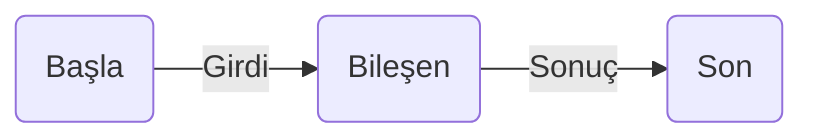
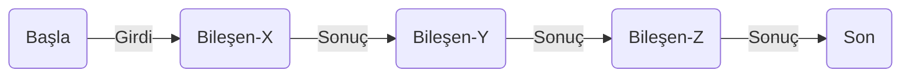

# Uruz Yaşam Ağacının Temelleri
\
**Belge Sürümü:**
V1.0
\
**Belgeyi Oluşturanlar:**
Utku Ün (Uruz)

---

## Genel İlke - 1
Her bileşen **bir girdi alır** ve **bir sonuç üretir.**
\
Bu yaklaşımın temel prendipleri:
- **Bağımsızlık:**
  Bileşenler birbirinden bağımsızdır, yalnızca kendi girdileriyle çalışır.
- **Modülerlik:**
  Her bileşen tek başına test edilebilir ve yeniden kullanılabilir.
- **Kompozisyon:**
  Bir bileşenin çıktısı başka bir bileşenin girdisi olabilir, böylece akış
  zincirleri kurulabilir.

## Genel İlke - 2

## Tek Bileşen Akışı
- Bir bileşen yalnızca girdisini işleyip sonuç üretir.
- Aynı bileşen girdisinin doğru tipte olduğunu kontrol ederek garanti
  eder. Yani **her bileşen giriş ve çıkış sözleşmesini tanımlar.**
- Aynı bileşen **eğer gerek duyuluyorsa** girdiden sonuç üretebildiği gibi
  sonuçtanda girdiyi tekrar üretebilmelidir (**tersine mühendislik**).

**Özellikler:**
- İzole çalışma ortamı
- Hata izolasyonu kolaylığı
- Basit test edilebilirlik

## Çoklu Bileşen Akışı
- Birden fazla bileşen birbirine bağlanarak daha karmaşık bir akış oluşturur.
- Aynı anda birden fazla bileşen farklı girdiler üzerinde çalışabilir.

**Özellikler:**
- Zincirleme veri akışı
- Esnek sistem tasarımı
- Yeniden kullanılabilir modüller
